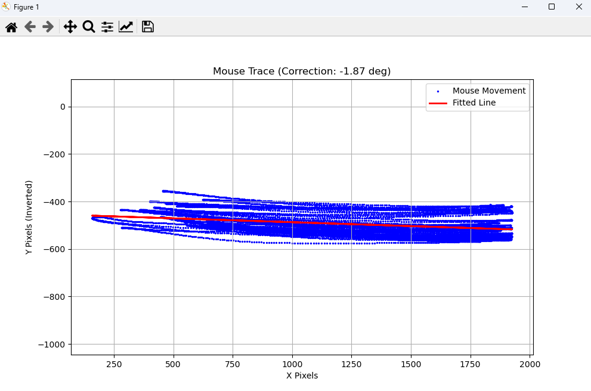

# 鼠标传感器角度校准工具 (Mouse Sensor Rotation Calibrator)

这是一个基于 Python 的实用小工具，旨在帮助 FPS 玩家或外设发烧友计算鼠标传感器的物理偏转角度。

## 为什么需要这个？

每个人的握持姿势（抓握、趴握、指握）和手腕摆动习惯都不同。当你凭肌肉记忆向右平移鼠标时，如果鼠标传感器相对于你的手掌存在角度偏差，屏幕上的光标实际上会走出一条倾斜的线（向右上或右下飘），这会影响你在游戏中的拉枪定位准确性。

这个工具通过记录你的自然平移轨迹，利用线性回归算法计算出偏差角度，并给出修正建议。

## 环境依赖

*   Python 3.6+
*   依赖库：`pynput`, `numpy`, `matplotlib`

## 安装说明

1.  **克隆或下载**本仓库代码。
2.  确保已安装 Python 环境。
3.  在项目目录下打开终端，运行以下命令安装依赖：

```bash
pip install -r requirements.txt
```

*如果还没有创建 `requirements.txt`，可以直接运行：*
`pip install pynput numpy matplotlib`

## 使用方法

1.  **运行程序**：
    ```bash
    python test.py
    ```
    
2.  **准备姿势**：
    以你玩游戏时最自然、最常用的姿势握住鼠标。

3.  **开始采集**：
    *   按住 **鼠标左键** 不放。
    *   闭上眼睛（或不看光标），凭肌肉记忆在鼠标垫上进行 **水平左右横移**。
    *   *提示：尽量模拟你在游戏中甩枪的感觉，而不是看着屏幕刻意画直线。*

4.  **查看结果**：
    *   松开 **鼠标左键**。
    *   程序会弹出一个图表窗口，显示你的实际轨迹（蓝色散点）和拟合直线（红色线）。
    *   **终端控制台** 会输出具体的计算结果和调整建议。

## 结果解读与修正

程序会根据你的轨迹计算出斜率和角度。

### 控制台输出示例：



```text
拟合斜率: 0.03261
检测到的偏转角度: 1.87°
结论：传感器【顺时针】歪了 (右边偏低)。
建议：在驱动中将角度调整 -1.9° (逆时针修正)。
```


